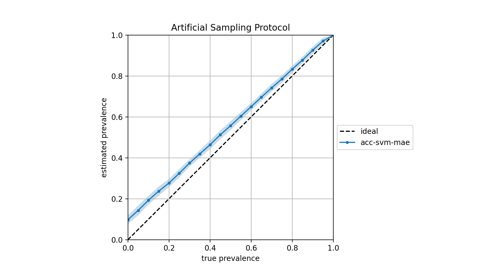

# Reassessing "Classify & Count" Quantification Method

## ECIR2021: Reproducibility track

This repo contains the code to reproduce all experiments discussed 
in the paper entitled _Reassessing "Classify & Count" Quantification Method_
which is submitted for consideration to the _ECIR2021's track on Reproducibility_

## Requirements
* skicit-learn, numpy, ...
* svmperf with patch (see below)
* pytorch ...

### SVM-perf with quantification-oriented losses
In order to run experiments involving SVM(Q), SVM(KLD), SVM(NKLD),
SVM(AE), or SVM(RAE), you have to first download the 
[svmperf](http://www.cs.cornell.edu/people/tj/svm_light/svm_perf.html) 
package, apply the patch 
[svm-perf-quantification-ext.patch](./svm-perf-quantification-ext.patch), and compile the sources.
The script [prepare_svmperf.sh](prepare_svmperf.sh) does all the job. Simply run:

```
./prepare_svmperf.sh
```
The resulting directory [svm_perf_quantification](./svm_perf_quantification) contains the
patched version of _svmperf_ with quantification-oriented losses. Make sure that the variable
_SVM_PERF_HOME_ from [./src/settings.py](./src/settings.py) points to the right path if you
decide to move it somewhere else.

The [svm-perf-quantification-ext.patch](./svm-perf-quantification-ext.patch) is an extension of the patch made available by
[Esuli et al. 2015](https://dl.acm.org/doi/abs/10.1145/2700406?casa_token=8D2fHsGCVn0AAAAA:ZfThYOvrzWxMGfZYlQW_y8Cagg-o_l6X_PcF09mdETQ4Tu7jK98mxFbGSXp9ZSO14JkUIYuDGFG0) 
that allows SVMperf to optimize for
the _Q_ measure as proposed by [Barranquero et al. 2015](https://www.sciencedirect.com/science/article/abs/pii/S003132031400291X) 
and for the _KLD_ and _NKLD_ as proposed by [Esuli et al. 2015](https://dl.acm.org/doi/abs/10.1145/2700406?casa_token=8D2fHsGCVn0AAAAA:ZfThYOvrzWxMGfZYlQW_y8Cagg-o_l6X_PcF09mdETQ4Tu7jK98mxFbGSXp9ZSO14JkUIYuDGFG0)
for quantification.
This patch extends the former by also allowing SVMperf to optimize for 
_AE_ and _RAE_.

## Datasets
The datasets _Kindle_, _HP_, and _IMDb_ can be downloaded from the 
[repo](https://doi.org/10.5281/zenodo.4117827) of A.Esuli, and are 
already preprocessed.

Run the script:
```
./prepare_datasets.sh
```
to automatically download them all.


## Reproduce Experiments
All experiments and tables reported in the paper can be reproduced by running the script in 
[./src](./src) folder:

```
./experiments.sh
``` 
Each of the experiments runs the [main.py](src/main.py) file with different arguments. 
Run the command:
```
python main.py --help
```
to display the arguments and options:
```
main.py:
  --dataset: the path of the directory containing the dataset (train.txt and
    test.txt)
  --error: error to optimize for in model selection (none acce f1e mae mrae)
    (default: 'mae')
  --learner: a classification learner method (svm lr mnb rf cnn)
  --method: a quantificaton method (cc, acc, pcc, pacc, emq, svmq, svmkld,
    svmnkld, svmae, svmrae, hdy, mlpe, quanet)
  --[no]plot: whether or not to plot the estimated predictions against the true
    predictions
    (default: 'false')
  --results_path: where to pickle the results as a pickle containing the true
    prevalences and the estimated prevalences
    (default: '../results')
  --sample_size: sampling size
    (default: '500')
    (an integer)
  --suffix: a suffix to add to the result file path, e.g., "run0"
    (default: '')
``` 
For example, the following command will train and test the _Adjusted Classify & Count_ variant 
with a _SVM_ as the learner device for classification, and will perform a grid-search
optimization of hyperparameters in terms of _MAE_. 
```
python main.py --dataset ../datasets/kindle --method acc --learner svm --error mae
```
The program will produce a pickle file in _../results/kindle-acc-svm-500-mae.pkl_ that contains 
the true prevalences of the sampled used during test (a _np.array_ of 2100 prevalences, 
21 prevalences x 100 repetitions, according to the _artificial sampling protocol_) and 
the estimated prevalences 
(a _np.array_ with the 2100 estimations delivered by the ACC method for each of the test 
samples). 

The resulting pickles are used for evaluating and comparing the different runs.
The evaluation of the current run is shown before exiting. In this example:

```
optimization finished: refitting for {'C': 0.001, 'class_weight': 'balanced'} (score=0.02204) on the whole development set

TrueP->mean(Phat)(std(Phat))
======================
0.000->0.098(+-0.0212)
0.050->0.143(+-0.0244)
0.100->0.193(+-0.0214)
0.150->0.237(+-0.0228)
0.200->0.277(+-0.0198)
0.250->0.324(+-0.0205)
0.300->0.374(+-0.0179)
0.350->0.419(+-0.0190)
0.400->0.464(+-0.0206)
0.450->0.513(+-0.0217)
0.500->0.557(+-0.0213)
0.550->0.604(+-0.0200)
0.600->0.650(+-0.0178)
0.650->0.696(+-0.0180)
0.700->0.742(+-0.0187)
0.750->0.786(+-0.0182)
0.800->0.833(+-0.0166)
0.850->0.878(+-0.0162)
0.900->0.926(+-0.0176)
0.950->0.971(+-0.0158)
1.000->0.999(+-0.0040)

Evaluation Metrics:
======================
	mae=0.057
	mrae=2.552
```

Use the _--plot True_ option to visualize the "diagonal plot", in which the estimated prevalences
are shown in the y-axis vs the true prevalences, which are shown along the x-axis.
Dots indicate the average across 100 experiments for a given sampling prevalence, while the
width of the colored band indicates the standard deviation. 



